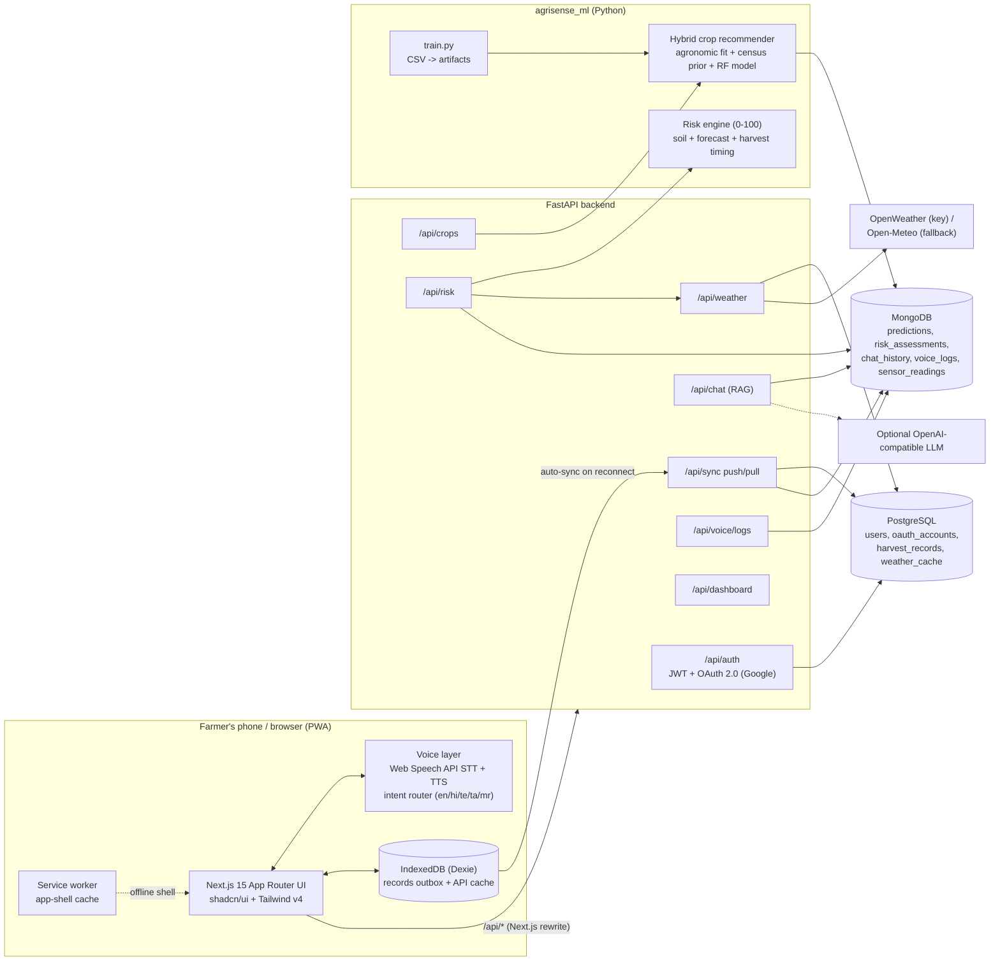

# AgriSense architecture

## System diagram



## Folder structure

```
AgriSense2.0/
├── frontend/                     Next.js 15 + React 19 + TypeScript PWA
│   ├── public/                   manifest.webmanifest, sw.js, icons/
│   └── src/
│       ├── app/
│       │   ├── layout.tsx        fonts (Noto Latin/Devanagari/Telugu/Tamil), providers
│       │   ├── login/            voice login + manual phone/PIN form + register + Google
│       │   ├── auth/callback/    OAuth token hand-off
│       │   └── (app)/            authenticated shell (collapsible side menu)
│       │       ├── dashboard/  crop/  risk/  weather/
│       │       └── records/  assistant/  settings/  profile/
│       ├── components/
│       │   ├── app-provider.tsx  language, auth, online state, sync state
│       │   ├── voice-provider.tsx speech recognition, intent routing, TTS, voice logs
│       │   ├── app-shell.tsx     hamburger/side menu, status badges, mic button
│       │   ├── agri/             soil fields, location picker, chat panel, risk gauge…
│       │   └── ui/               shadcn/ui (Radix) primitives
│       └── lib/
│           ├── voice/commands.ts multilingual intent + soil-value parser
│           ├── voice/speech.ts   Web Speech API hooks
│           ├── i18n.ts           en / hi / te / ta / mr dictionaries
│           ├── offline-db.ts     Dexie schema (records outbox, cache)
│           ├── sync.ts           push/pull sync with last-write-wins
│           └── api.ts            fetch wrapper with JWT refresh
├── backend/                      FastAPI
│   ├── app/
│   │   ├── main.py               app factory, CORS, router wiring, startup
│   │   ├── core/                 settings (env), JWT/bcrypt helpers
│   │   ├── db/                   postgres.py (SQLAlchemy 2), mongo.py (PyMongo + indexes)
│   │   ├── models/sql.py         User, OAuthAccount, HarvestRecord, WeatherCache
│   │   ├── routers/              auth, crops, risk, weather, chat, sync, voice, dashboard, meta
│   │   ├── services/             ml.py, weather.py, rag.py
│   │   └── rag_corpus/           prevention + crop guides used by the RAG assistant
│   └── tests/                    API tests (SQLite + mongomock, no network)
├── ml/                           agrisense_ml package
│   ├── agrisense_ml/             knowledge.py, train.py, predictor.py, risk.py, scoring.py
│   ├── data/raw/                 supplied CSVs (gzipped)
│   └── tests/
├── docs/                         this file, reference/ (original v1 server + README)
└── docker-compose.yml            postgres, mongo, backend, frontend
```

## Data placement

| Store | Data | Why |
| --- | --- | --- |
| PostgreSQL | users, OAuth accounts, harvest records, weather cache | relational, unique constraints (phone, provider+subject, user+client_id) |
| MongoDB | crop predictions, risk assessments, chat history, voice logs, sensor readings | flexible, nested payloads that change shape as models evolve |
| IndexedDB | offline outbox of soil readings + harvest records, cached API responses | works with no network; synced on reconnect |

## Offline sync protocol

1. Every soil reading / harvest record gets a client UUID and `updated_at` and is written to IndexedDB with `synced = 0`.
2. On `online` events, login, every 60 s, or the user saying "sync", the client calls `POST /api/sync/push` in batches of 50.
3. The server upserts per `(user, client_id)` — soil readings into Mongo `sensor_readings`, harvest records into Postgres `harvest_records` — and returns `created | updated | skipped_stale | error` per record. Pushes are idempotent and last-write-wins on `updated_at` (millisecond precision, Mongo's resolution).
4. `GET /api/sync/pull?since=` returns server-side changes so a second device gets the same records.
5. The header shows Online/Offline, a pending counter, and a progress bar while syncing.

## Crop recommendation

`score = w_agro · agronomic_fit + w_ml · ml_probability + w_region · census_share`, then a season adjustment.

- **Agronomic fit**: distance of N, P, K, pH, soil temperature and moisture from each crop's ideal range (`knowledge.py`, seeded from the v1 `server.py` profiles).
- **Census prior**: share of the state's cropped area from `state-level-agcensus-crop.csv` (latest year, 2015-16).
- **ML model**: RandomForest trained on `sensor_Crop_Dataset (1).csv`. Its weight is `min(0.5, (accuracy − chance) / (1 − chance))`. The supplied dataset scores 16.6% against 16.7% chance (per-crop feature means are identical), so its weight is **0** today; drop in a better dataset, re-run `python -m agrisense_ml.train`, and the weight rises automatically.

Outputs: top 5 crops, yield potential (t/ha, scaled by fit), harvest window from sowing date + crop duration, limiting factors, and the component weights.

## Risk engine (0-100)

Weighted factors, each scored 0-1 and explained in plain language: soil pH, nutrients, soil moisture, soil temperature, forecast heat/cold stress, excess rain, dry spell, humid disease pressure, harvest timing vs crop maturity. Forecast days are clipped to the planned harvest date. Factors without data (e.g. no forecast) are dropped from the denominator instead of counting as zero risk. `low < 30 ≤ moderate < 60 ≤ high`. The factor tags drive RAG retrieval of prevention steps.

## RAG assistant

TF-IDF retrieval over `backend/app/rag_corpus/*.md`, the v1 README, and passages generated from the datasets (census crop shares per state, weather baselines from `weather-1.csv`, crop profiles, model card). With `LLM_API_KEY` set it calls an OpenAI-compatible chat model with the retrieved context and the latest risk result; otherwise it returns the top retrieved passages (extractive mode). Every answer lists its sources.

## Voice

- STT: `SpeechRecognition` / `webkitSpeechRecognition` with `en-IN`, `hi-IN`, `te-IN`, `ta-IN`, `mr-IN`.
- Intent routing: keyword rules for every language matched regardless of the active language (farmers mix English words), longest match wins; page handlers get first refusal (e.g. soil forms parse "nitrogen 90 phosphorus 40 pH 6.5", Indic digits normalised).
- Global intents: navigate (dashboard/crop/risk/weather/records/assistant/settings/profile/login), logout, dark/light mode, switch language, sync, submit form, read page aloud, help.
- TTS: `speechSynthesis` in the active language for confirmations, results and the voice-login prompts.
- Voice login: speaks "say your phone number" → captures digits → "say your PIN" → logs in. The manual form is always available.
- Transcripts, matched intents and confidence are batched to `POST /api/voice/logs` (Mongo) to improve the command set.

## Roadmap

| Phase | Scope |
| --- | --- |
| Done (this PR) | Architecture, FastAPI + Postgres + Mongo, JWT + Google OAuth, crop + risk ML, 16-day weather, RAG assistant, offline sync, 5-language voice UI, PWA |
| Next | Better crop dataset (real soil-test labels) to give the ML model weight; Alembic migrations; OTP login via SMS; rate limiting; Sentry/OpenTelemetry |
| Later | Vector embeddings for RAG (multilingual model) and a hosted LLM; push notifications for risk changes; IoT sensor ingestion endpoint; mandi price module |
